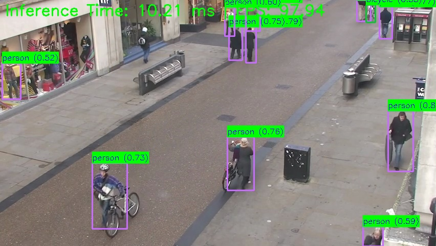
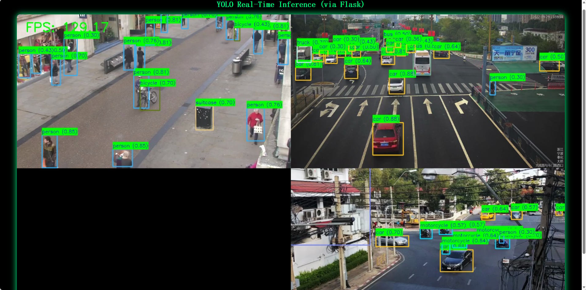

# YOLOv8 视频目标检测系统

本项目使用 YOLOv8 模型进行实时视频目标检测，支持多视频流并行处理和 Web 界面展示。

## 模型文件说明

本项目包含两个量化模型文件，适用于不同的硬件平台：

1. **QCS6490 平台模型**：
   - 路径：`model/6490/cutoff_yolov8s_qcs6490_w8a8.qnn231.ctx.bin`
   - 量化类型：INT8 权重和 INT8 激活 (w8a8)
   - 适用平台：Qualcomm QCS6490 芯片

2. **QCS8550 平台模型**：
   - 路径：`model/8550/cutoff_yolov8s_qcs8550_w8a16.qnn231.ctx.bin`
   - 量化类型：INT8 权重和 INT16 激活 (w8a16)
   - 适用平台：Qualcomm QCS8550 芯片

## 使用步骤

### 1. 环境准备

确保安装了以下依赖：
- Python 3.6+
- OpenCV
- NumPy
- AIDLite (用于模型加速)
- Flask (仅 Web 版本需要)

### 2. 运行本地视频检测

#### 2.1 使用 QCS6490 模型
```bash
# 使用专用脚本
python qnn_video_6490.py
```

#### 2.2 使用 QCS8550 模型
```bash
# 使用专用脚本
python qnn_video_8550.py
```

### 3. 运行 Web 视频检测

#### 3.1 使用 QCS6490 模型
```bash
# 使用专用脚本
python web_qnn_video_6490.py
```

#### 3.2 使用 QCS8550 模型
```bash
# 使用专用脚本
python web_qnn_video_8550.py
```

然后在浏览器中访问：`http://<设备IP>:14514` 查看检测结果。

## 代码文件区别

### 本地版本 vs Web 版本

| 特性 | 本地版本 (qnn_video_*.py) | Web 版本 (web_qnn_video_*.py) |
|------|--------------------------|----------------------------|
| 显示方式 | 使用 OpenCV imshow 本地显示 | 使用 Flask Web 服务器浏览器访问 |
| 线程处理 | 单线程 | 多线程（Web 服务和视频处理分离） |
| 输出信息 | 详细的检测信息和性能统计 | 简化输出，减少控制台信息 |
| 访问方式 | 本地窗口 | 网络浏览器 |
| 依赖项 | OpenCV, NumPy, AIDLite | OpenCV, NumPy, AIDLite, Flask |
| 适用场景 | 本地开发和测试 | 远程访问和演示 |

### 模型专用版本

| 脚本名称 | 适用模型 | 特点 |
|---------|---------|------|
| qnn_video_6490.py | QCS6490 模型 | 针对 QCS6490 芯片优化，使用正确的张量顺序 |
| qnn_video_8550.py | QCS8550 模型 | 针对 QCS8550 芯片优化，使用正确的张量顺序 |
| web_qnn_video_6490.py | QCS6490 模型 | Web 版本，针对 QCS6490 芯片优化 |
| web_qnn_video_8550.py | QCS8550 模型 | Web 版本，针对 QCS8550 芯片优化 |

## 性能特点

- 使用 DSP 硬件加速，提高推理速度
- 支持量化模型，减少模型大小和计算量
- 实时处理三个视频流，展示多通道并行能力
- 提供详细的性能统计，包括推理时间、后处理时间和 FPS

## 检测类别

支持 COCO 数据集的 80 个类别，包括人物、车辆、动物、日常物品等。

## 检测效果展示

以下是目标检测的效果展示：

### 输入图像


### 模型输出


### 界面展示


## 注意事项

- 确保视频文件路径正确，默认路径为 `video/1.mp4`、`video/2.mp4`、`video/3.mp4`
- 根据运行平台选择合适的模型文件
- Web 模式下，确保网络连接正常，且防火墙允许 14514 端口访问
- 按下 'q' 键退出本地显示模式
- **KeyboardInterrupt 说明**：当使用 Ctrl+C 终止程序时，可能会看到 `KeyboardInterrupt` 错误信息，这是正常的中断行为，不是程序错误
- **张量顺序问题**：两个模型文件的输出张量顺序不同
  - 6490模型：tensor 0是边界框，tensor 1是类别置信度
  - 8550模型：tensor 0是类别置信度，tensor 1是边界框
  - 代码已自动检测模型类型并调整张量顺序，无需手动修改
- **正确退出方式**：
  - 本地模式：按下 'q' 键优雅退出
  - Web 模式：使用 Ctrl+C 终止进程，然后关闭浏览器标签页
